# Project Documentation

**Initial Understanding of Problem**

Generally, I am a person who likes to follow a systematic approach. I divided the tasks counting the number of days I had to complete the task.

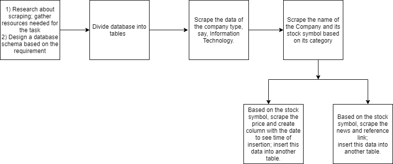

## Day 1: 

### Implemented:
1. I went through few blogs and articles on how to get start with scraping because this was my first time.
2. I tried scraping sample pages just to get familiar.
3. Depending on the requirements, I designed a database schema.

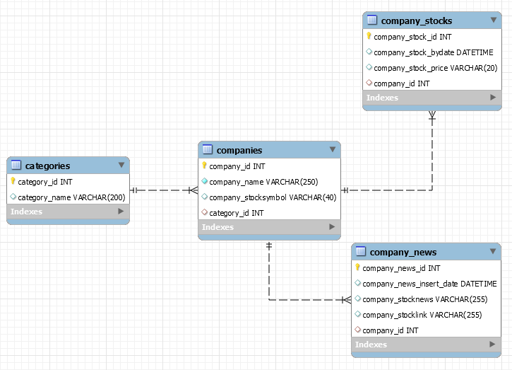

### learned Concepts: 
How to scrape using BeautifulSoup?

#### References:

1. [Why choose beautifulsoup over scrapy](https://hexfox.com/p/scrapy-vs-beautifulsoup/)
1. [Beautiful soup](https://www.dataquest.io/blog/web-scraping-beautifulsoup/)
2. [Documentation for Beautiful Soup](https://www.crummy.com/software/BeautifulSoup/bs4/doc/)
3. [Tutuorials for BeautifulSoup](https://pythonprogramming.net/introduction-scraping-parsing-beautiful-soup-tutorial/)

## Day 2:

I created 4 tables (table 1 contains categories, table 2 contains companies and stocks, table 3 contains company stock prices, and table 4 contains the company's stock news)

### Implemented:

1. Successfully extracted the categories from the [Hampton Roads Alliance](https://hamptonroadsalliance.com)

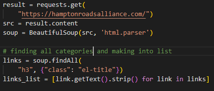

2. Created a Database connection.

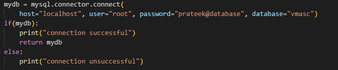

3. Created a list of the categories from the scraped data and inserted it into the category table.

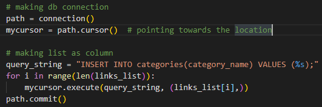

4. Extracted company names and stock symbols using the web resources given and stored in dictionary format, "categories":"companynames".

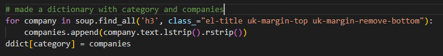

5. Based on the category id of the category table, inserted extracted company names and stock prices into companies table.

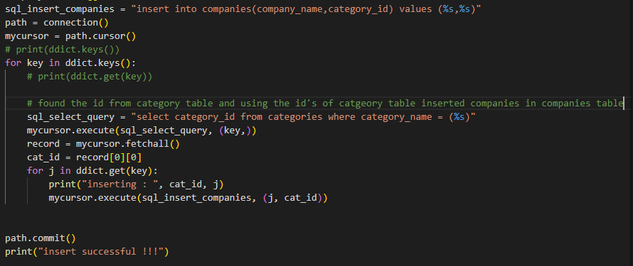

### Learned Concepts:

1. Hierarchical approach: I learned how to use the hierarchical approach for this task.

### Problems Faced:

1. Extracting Stock Symbol was a challenge because few companies didn't have a stock symbol and few companies were under parent company stocks.

### Can also use: Yahoo Screener and [Screener](www.screener.in) etc.

It is like a private company that maintains database for companies and their stock symbols. They also provide historical data which can be used for analysis and stock prediction.

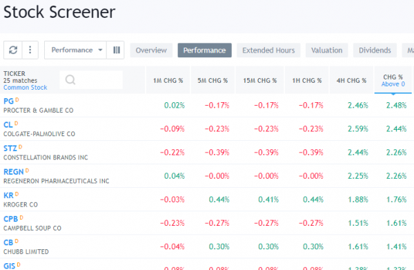

### Outputs obtained:

**Categories Table:**

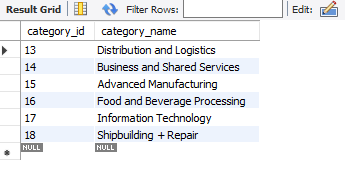

**Companies Table:**

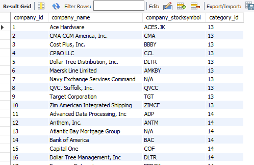

### References:

1. [Connecting to Database](https://pynative.com/python-mysql-insert-data-into-database-table/)
2. [Pushing list into MySql](https://stackoverflow.com/questions/54518722/mysql-connector-could-not-process-parameters)
3. [Integratiing MySql with python](https://www.youtube.com/watch?v=WWcvMASweTg)

## Day 3:

Worked on Extracting stock prices and stock news.

### Implemented:

1. I found the pattern in url link of the stock prices website. Using that link I used loop to scrape stock prices and pass all stock_symbols to get the price of each company.

2. Extracted company_id using the stock symbols from the companies tables and used the company_id to insert stock prices in the company_stocks table. I have also created a column in the company_stocks table which would automatically store date and time in the record of when the new stock prices are inserted. 

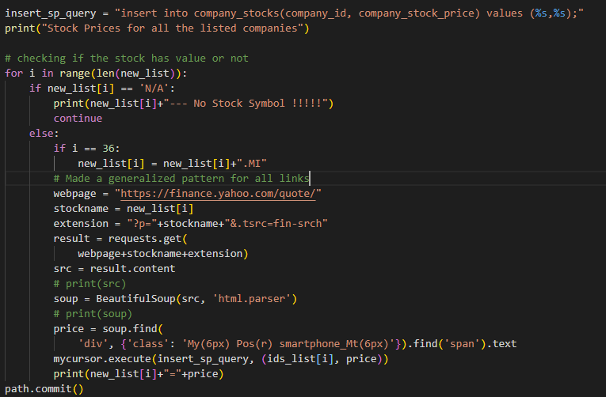

3. As the stock prices changes continously, I used the package named scheduler to run the program for scraping the stock prices for every 1 min and store it in the table

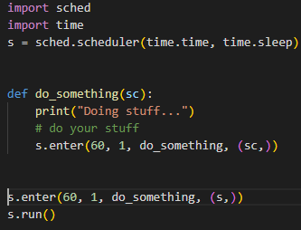

4. Similary for stock news, I found the pattern in the url link and using that link I looped for all the stock symbols into a list and stored into the company_news table.

**News from Yahoo Fianance**

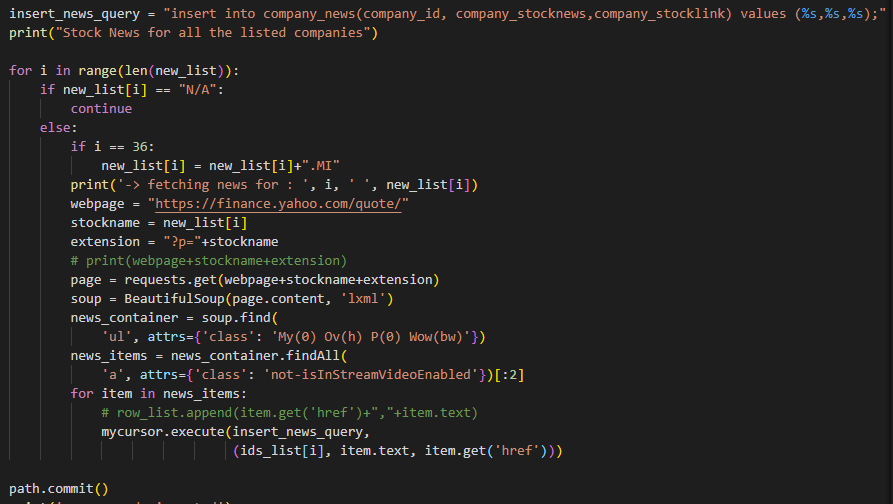

5. In the stock_news I have stored the links and news in seperate columns along with the time of when the record was inserted

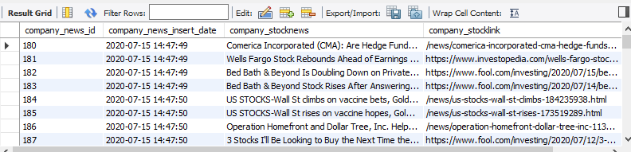

**News From Google Finance**

Later, I worked on the extracting the news from google finance to extract the news. I haven't inserted this into the database as it already has records of the yahoo finance news so I just showed output just in console.

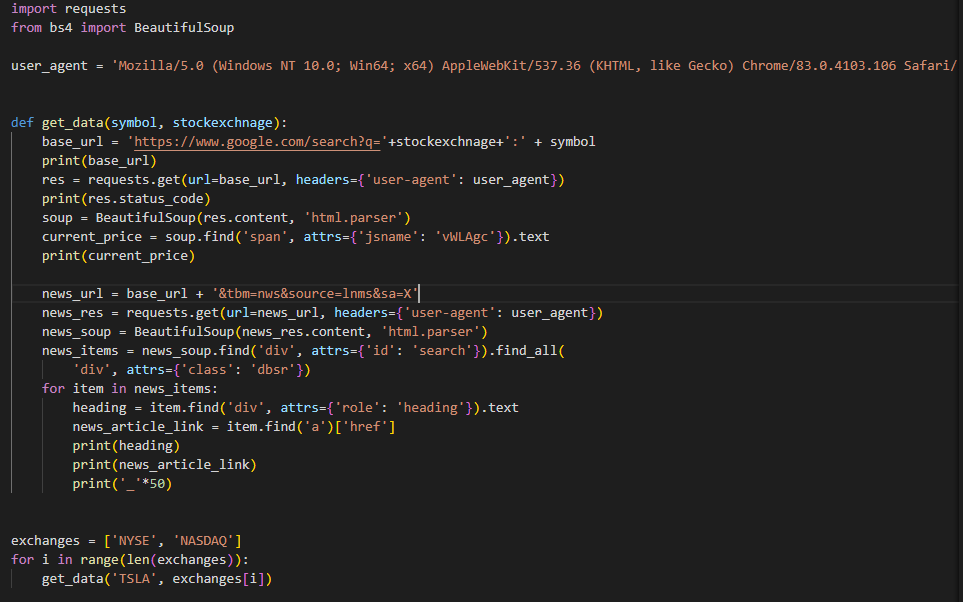

### Learned Concepts:

1. Extract data continously using scheduler.
2. Storing continous data in the database.

### Outputs Obtained:

**Company Stock Price Table:**

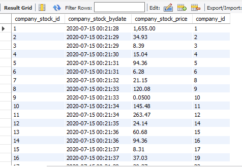

**Company Stock News Table:**

### References:

1. [scraping from google finance: ](https://www.scrapehero.com/how-to-prevent-getting-blacklisted-while-scraping/#:~:text=A%20user%20agent%20is%20a,the%20detection%20of%20a%20bot.)
2. [Scraping finance data ](https://hackernoon.com/scraping-yahoo-finance-data-using-python-ayu3zyl)
3. [stock fetching app](https://stackoverflow.com/questions/5081710/how-to-create-a-stock-quote-fetching-app-in-python)

## Day 4:

Worked with NodeJs to create an api which runs on server.

### Implemented:

1. Extracted the data from the MySQL database to Express. Used nodemon to auto update the page everytime there is a change in the code.

2. Created APIs for all the tables and displayed them in Postman.

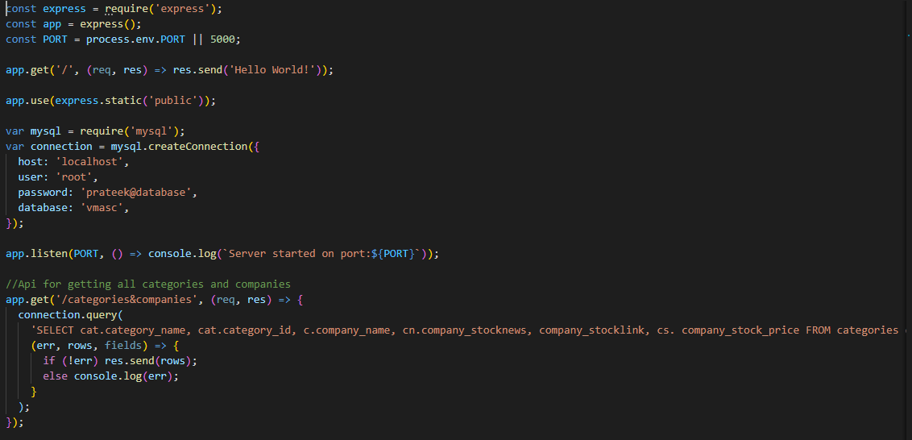

**Query Used:**
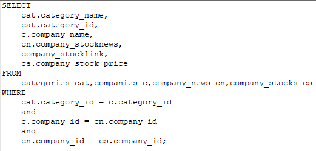

### Outputs Obtained

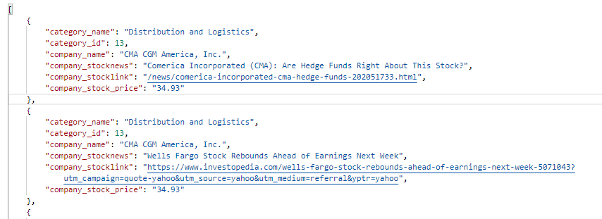

### References:

1. [connecting to database using express](https://stackoverflow.com/questions/50093144/mysql-8-0-client-does-not-support-authentication-protocol-requested-by-server)
2. [sending data from mysql to express](https://www.youtube.com/watch?v=rZun6_NkulM)

## Future Proposals:

1. Using Python, retrieve the files from mySQL in the form of CSVs. This could be used for generating Visualizations using d3.js.
2. Try to identify the correlation between the news and the stock price for that day.
3. Make predictions for the stock in future using Machine Learning.
4. Creating a UI that would provide the updated stock prices and news of a a particular stock when you click on it

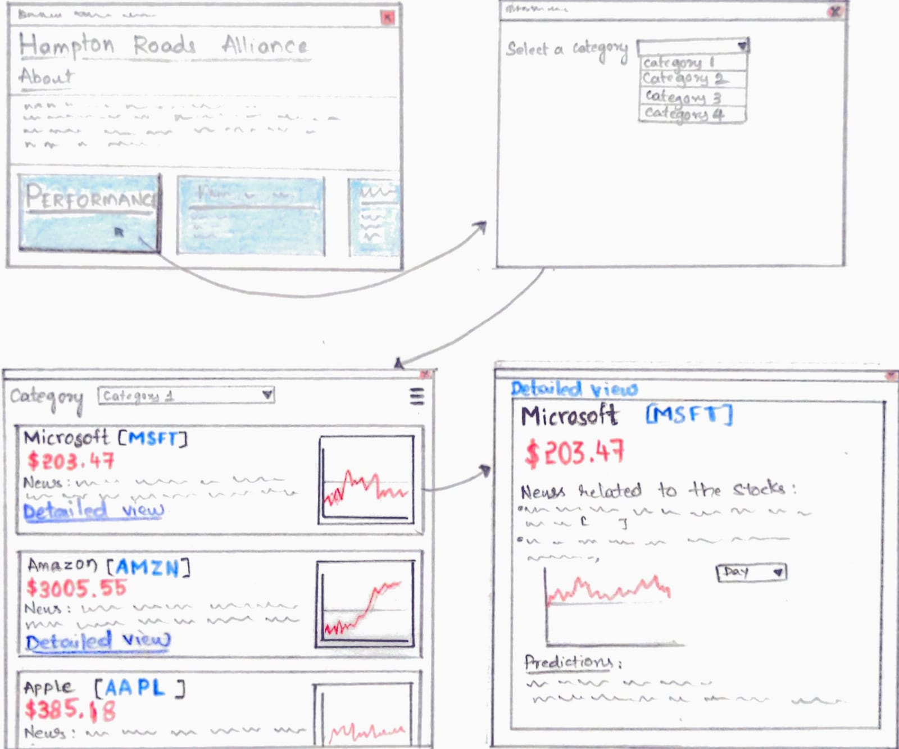

## Solution when working in a Team

1. Divide the tasks between two major teams – Front End and Back End.
2. Front End team works on retrieving the data from the API and displaying on a UI.
3. Back End team can be further divided to two teams – one team works on designing the database and generating APIs.
4. The other team scrapes the data from the available resources and store it in a database team. This team could work as a Database Management Team.
5. If you consider future proposals, an additional team is required. This team will be working on machine learning part where they have to predict the stocks and also analyze the trends.

## References:

1. [visualizations](https://gist.github.com/ruanbekker/f4c5d917dd4d1b777b39c86240948dd2)
2. [Kaggle](https://www.kaggle.com/questions-and-answers/54953,https://ruddra.com/make-csv-file-using-mysql-and-python/)
3. [Predict stock using machine learning and python](https://www.youtube.com/watch?v=QIUxPv5PJOY)
